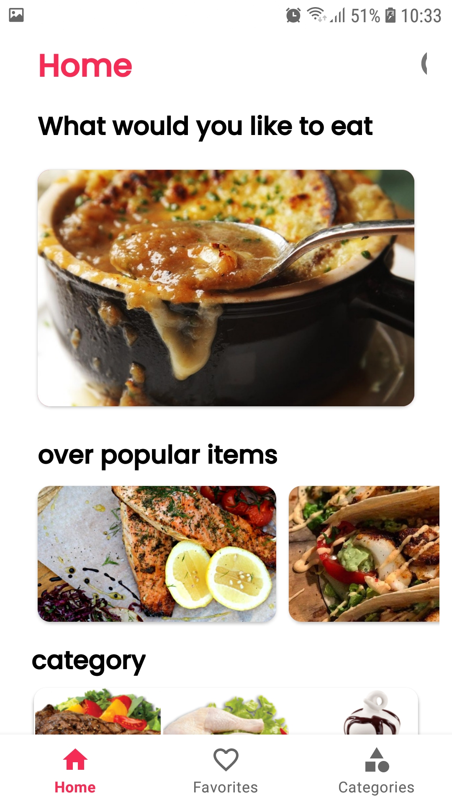
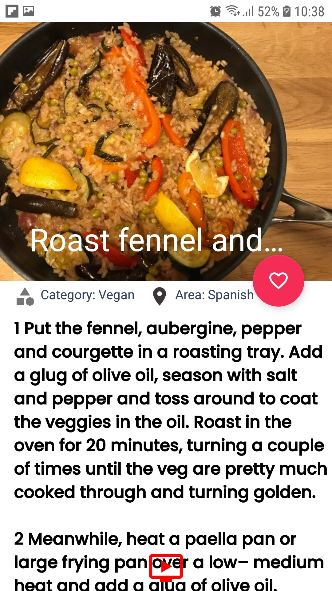
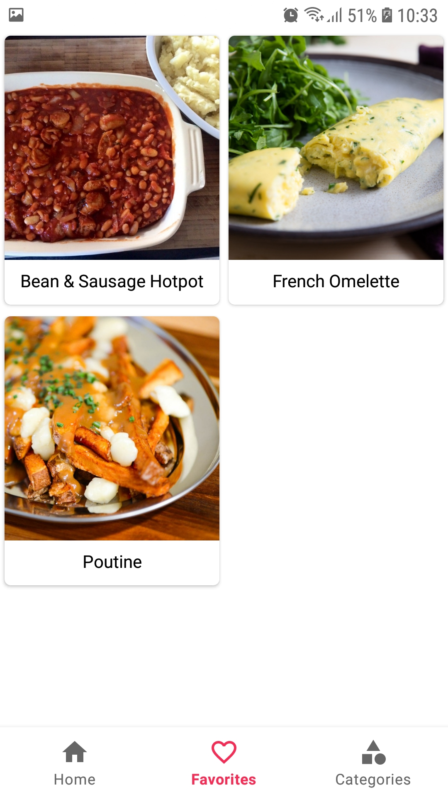
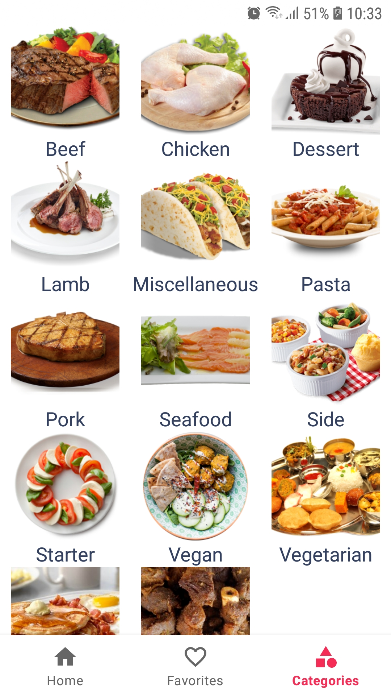

# ExpressFood App

ExpressFood is an Android application built using the MVVM architecture that allows users to explore and discover various food meals. The app consumes a meals API to provide users with information about popular meals, categories, and favorites.

## Features

- Display a list of popular meals along with their categories.
- Browse different food categories.
- View detailed information about a specific meal.
- Mark meals as favorites and view them in a separate screen.

## Screenshots

### Home Screen

### Meal Detail Screen

### Favorite Screen

### Categories Screen

## Technologies Used

- Android SDK
- Kotlin programming language
- MVVM architecture
- Retrofit for API communication
- Room for local database storage
- Glide for image loading
- Navigation Component for navigation between screens

